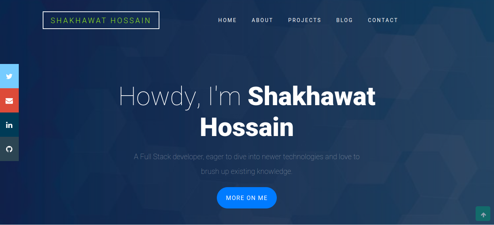

<h1 align="center">Personal Portfolio 👋</h1>

The project is a solid structure for a more complex web page. Is basically a portfolio contains four major sections- 
1. (About Section) User's information
2. (Project Section) User's recent projects
3. (Article Section) User's blogs
4. (Contact section) Social icons with email address and mobile. 
## Table of Contents

- [Background](#background)
- [Install](#install)
- [Usage](#usage)
- [Deployment](#deployment)
- [Maintainers](#maintainers)
- [Contributing](#contributing)
- [License](#license)  

## Background

1. React
2. HTML CSS
3. Bootstrap

## Install
1. Run `npm install` on the terminal. It will install all the dependencies required for this project.

## Usage
To run the project:

- Clone the repository: `git@githubcom:shshamim63/personal-portfolio.git`
- Run `cd personal-portfolio` to enter into project folder. 
- Run `npm install` It will install all the dependencies required by the project
- Run `npm start` to start the development server. It will automatically open the page in your default browser.
- Run `npm run build` to get a deployable version.

## Deployment
[Live Demo](https://shakhawathossain.netlify.com/index.html)

## Maintainers

👤 **Shakhawat Hossain**
- Github: [@shshamim63](https://github.com/shshamim63)
- LinkedIn: [@shakhawathossainshamim](https://www.linkedin.com/in/shakhawathossainshamim/)
- Twitter: [@Shshamim090](https://twitter.com/Shshamim090)

## Contributing

**Always welcome to contribute if you want to make it better.**
1. Fork it (https://github.com/shshamim63/personal-portfolio)
2. Create your feature branch (git checkout -b feature/[choose-a-name])
3. Commit your changes (git commit -am 'what this commit will fix/add')
4. Push to the branch (git push origin feature/[chosen-name])
5. Create a new Pull Request

## License

This project is licensed under the MIT License - see the [LICENSE](./LICENSE) file for details